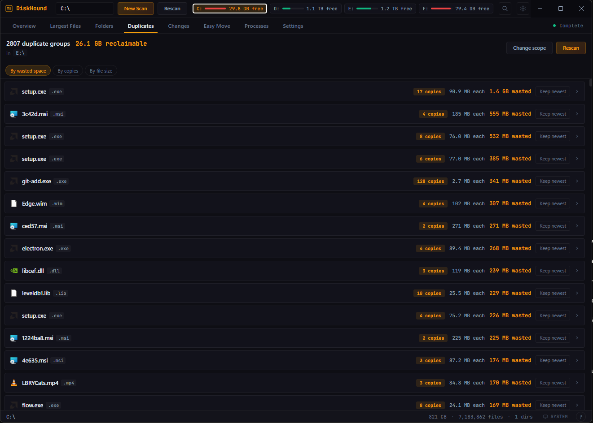
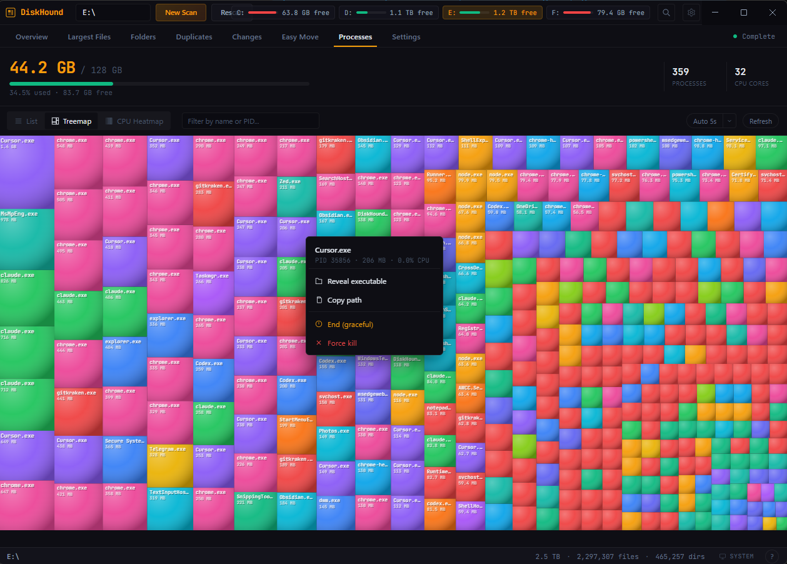
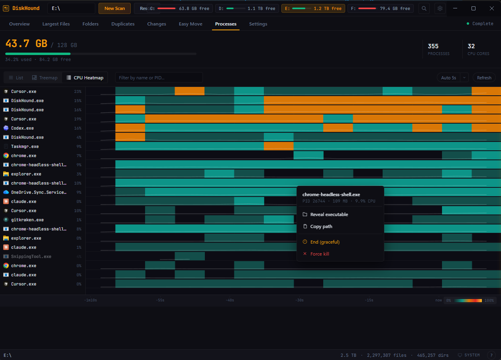

<p align="center">
  
</p>

<h1 align="center">DiskHound</h1>

<p align="center">
  <strong>Fast, cross-platform disk space analyzer.</strong><br>
  Find what's eating your drive, track changes over time, detect duplicates, and reclaim space.
</p>

<p align="center">
  <a href="https://github.com/tzarebczan/diskhound/actions/workflows/ci.yml"></a>
  <a href="https://github.com/tzarebczan/diskhound/releases/latest"></a>
  <a href="LICENSE"></a>
</p>

<p align="center">
  <strong>Downloads — one-click for your OS</strong><br>
  Each link points at the latest release on GitHub.
</p>

<p align="center">
  <a href="https://github.com/tzarebczan/diskhound/releases/latest/download/DiskHound-Setup.exe">Windows</a> ·
  <a href="https://github.com/tzarebczan/diskhound/releases/latest/download/DiskHound-universal.dmg">macOS (Universal)</a> ·
  <a href="https://github.com/tzarebczan/diskhound/releases/latest/download/DiskHound-x86_64.AppImage">Linux — AppImage</a> ·
  <a href="https://github.com/tzarebczan/diskhound/releases/latest/download/DiskHound-x64.tar.gz">Linux — tar.gz</a>
</p>

<p align="center">
  <a href="https://github.com/tzarebczan/diskhound/releases/latest">All releases & assets</a>
</p>

<p align="center">
  
</p>

---

## Why DiskHound

WinDirStat was the gold standard for a decade. DiskHound is what it would be today: a native Rust scanner, an instant-load treemap, real scan history with time-range diffs, duplicate detection, and reclaim space.

## Features

- 🦀 **Native Rust scanner** — reads the NTFS Master File Table directly on Windows drives (with admin), dropping cold scans on a 7 M-file drive from ~20 minutes to **under 90 seconds**. Falls back to a safe cross-platform walker when needed.
- 🗺️ **Interactive treemap** — squarified layout with 70+ file type colors. Two layouts: "Size" (largest-first, globally ordered) and "Tree" (WinDirStat-style — files cluster inside their directories).
- ⚡ **Incremental monitoring** — after the first full scan, DiskHound tracks disk changes via the NTFS USN journal (Windows) and an mtime-based smart rescan (cross-platform). Repeat scans on a monitored drive are extremely fast.
- 📈 **Scan history & diffing** — every scan is persisted. Compare any two snapshots with quick-select pills (1h / 6h / 1d / 1w / 1M / 3M). Browse the full per-file diff from the persistent index.
- 🔍 **Duplicate detection** — SHA-256 content hashing with two-pass optimization (4KB prefix rejection, then full hash). Concurrent I/O. "Keep newest" / "Keep oldest" bulk actions.
- 🔗 **Easy Move** — move a large file to another drive, leave a symlink or junction in its place. Fully reversible. Tracks every move so you can put files back with one click. Offers a one-UAC fast-scan mode for system installs.
- 📁 **Folder explorer** — drill into directories with breadcrumb navigation and proportional size bars.
- 🛎️ **Drive monitoring** — periodic free-space polling with delta alerts when space drops meaningfully. Rolling history of drive-level events is persisted.
- ⚙️ **Processes viewer** — real-time memory + CPU sampling for every process, with icons pulled from each executable. **Four views**: List, Treemap, scrolling CPU Heatmap (time on X, process on Y), and details.
- 🎮 **GPU viewer** — per-process GPU utilisation + VRAM pulled from Windows `\GPU Engine(*)` / `\GPU Process Memory(*)` performance counters. Adapter overview (3D / Compute / Decode / Encode stats).
- 💽 **Disk I/O viewer** — per-process read / write throughput with sortable columns and a live total. Windows uses `Win32_PerfFormattedData_PerfProc_Process`; Linux derives rates from `/proc/<pid>/io` deltas; macOS surfaces a clear "unavailable" state because Apple doesn't expose unprivileged per-process counters.
- 🪟 **System Widget** (`Ctrl+Shift+W`) — frameless always-on-top mini-window showing live disk capacity, disk I/O, CPU, GPU (Windows), memory, scan status, and per-drive pressure. Pin/unpin, drag anywhere on the title bar, remembers its size + position. Triggered from the header, the tray menu, or the keyboard shortcut.
- 🔐 **One-UAC fast-scan mode** — Settings → Performance → "Always run as admin" registers a Scheduled Task bound to the current user's SID, so the normal shortcut auto-elevates with **zero additional prompts**.
- 🌓 **Dark & light themes** — with system preference detection. Toggle from the status bar.
- ⌨️ **Keyboard navigation** — arrow keys in the file list, Enter to open, Delete to trash, Ctrl+F to search, `Ctrl+Shift+W` to open the System Widget.
- 🔄 **Auto-update** — via `electron-updater` with GitHub Releases. UAC elevation supported for system-wide installs.

## Install

Use the one-click download links at the top of this README, or grab any release from the [Releases page](https://github.com/tzarebczan/diskhound/releases/latest).

| Platform | Artifact |
|---|---|
| Windows | `DiskHound-Setup.exe` — NSIS per-user installer with auto-update. |
| macOS | `DiskHound-universal.dmg` — single universal .dmg, native on both Apple Silicon and Intel Macs. |
| Linux | `DiskHound-x86_64.AppImage` (recommended — built-in auto-update) or `DiskHound-x64.tar.gz` (extract-and-run tree). |

## Screenshots

<table>
  <tr>
    <td align="center">
      <br>
      <sub><b>Duplicates</b> — find identical files by content hash</sub>
    </td>
    <td align="center">
      <br>
      <sub><b>Changes</b> — diff any two scans with time-range presets</sub>
    </td>
  </tr>
  <tr>
    <td align="center">
      <br>
      <sub><b>Folders</b> — drill into directories with size breakdowns</sub>
    </td>
    <td align="center">
      <br>
      <sub><b>Settings</b> — theme, scanning, monitoring, cleanup</sub>
    </td>
  </tr>
  <tr>
    <td align="center">
      <br>
      <sub><b>Processes</b> — memory treemap with real exe icons; right-click any rect for reveal / kill actions</sub>
    </td>
    <td align="center">
      <br>
      <sub><b>CPU Heatmap</b> — scrolling waterfall where the right edge is NOW; sparklines call out recent CPU activity</sub>
    </td>
  </tr>
</table>

## Development

**Requirements:** [Bun](https://bun.sh/) 1.3+, [Rust](https://rustup.rs/) (stable), Node.js 20+ (bundled with Electron).

```bash
# Clone and install
git clone https://github.com/tzarebczan/diskhound
cd diskhound
bun install

# Build the native Rust scanner
bun run build:native

# Start in development mode (hot-reload renderer + Electron)
bun run dev
```

### Scripts

| Command | Description |
|---|---|
| `bun run dev` | Dev server with hot-reload |
| `bun run build` | Build renderer + Electron main process |
| `bun run build:native` | Build the Rust native scanner (release) |
| `bun run start` | Launch the built production app |
| `bun run dist` | Build everything and create the installer |
| `bun run test` | Run the Vitest test suite |
| `bun run typecheck` | TypeScript type checking |

### Architecture

```
src/
├── main.ts              Electron main process, IPC handlers
├── preload.ts           Context bridge (IPC → renderer)
├── nativeScanner.ts     Spawn and manage the Rust binary
├── scan/scanWorker.ts   JS fallback scanner (worker thread)
├── shared/
│   ├── contracts.ts     All TypeScript types and IPC interface
│   ├── scanDiff.ts      Snapshot diff algorithm (top-N)
│   ├── scanIndex.ts     Full per-file index + real diff engine
│   ├── scanHistory.ts   File-backed scan history store
│   ├── duplicates.ts    Duplicate detection engine
│   ├── easyMoveStore.ts Easy Move persistence and rollback
│   ├── diskMonitor.ts   Background disk space monitoring
│   └── pathUtils.ts     Shared path normalization
└── renderer/
    ├── App.tsx          App shell, tabs, header
    ├── components/      All view components
    └── lib/             Shared utilities, hooks, treemap algorithm

native/diskhound-native-scanner/
└── src/main.rs          Rust scanner (Win32 APIs + jwalk)
```

## How it works

**The scanner** writes two outputs for every completed scan:
1. A JSON snapshot with top-N largest files, hottest directories, and aggregate totals.
2. A gzipped NDJSON index containing every file's path, size, and mtime, plus directory mtime entries so the next scan can skip unchanged subtrees.

**The diff engine** uses the snapshot for the "biggest changes" overview, and the full index for "browse every change." Both are streamed and capped for memory safety. Aggregate totals (net bytes) are computed without loading the full index into memory.

**Incremental monitoring** has two tiers:
1. **USN journal (Windows)** — after a full scan anchors a cursor, subsequent monitoring ticks read only the NTFS change journal since that cursor. Creates/modifies/deletes are applied to a working index and merged.
2. **Mtime-based smart rescan (cross-platform)** — during a full walk, directories whose mtime matches the previous scan's baseline inherit their files from the baseline instead of being re-enumerated.

**Easy Move** uses platform-appropriate links: directory junctions on Windows (no admin), symlinks on macOS/Linux. Every move is journaled so it's fully reversible. Failed rollbacks are recorded for manual remediation.

**Process sampling** uses PowerShell `Get-Process` on Windows (fast, returns executable paths for icon resolution) with a fallback to basic `tasklist` if PowerShell is unavailable. macOS/Linux use `ps` and system reports.

## Contributing

Issues and PRs welcome. Please run `bun run typecheck && bun run test` before opening a PR.

## License

[MIT](LICENSE) © 2026 Thomas Zarebczan
